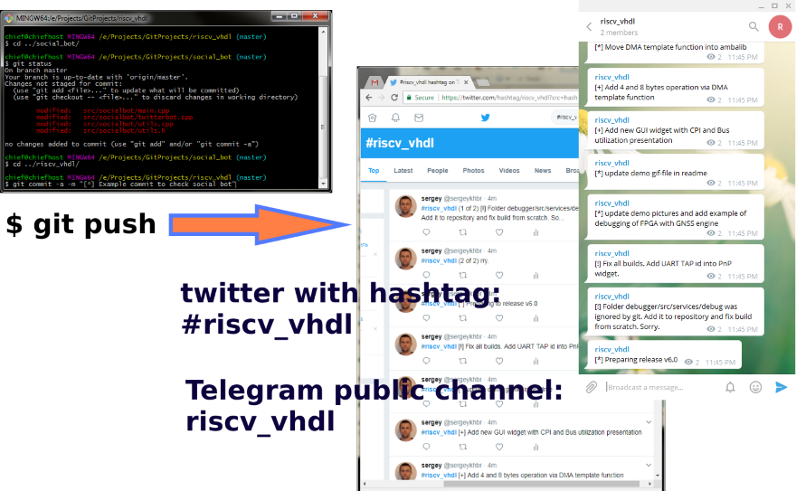

socialbot
=====================

## What is it?
It's a simple C++ program to translate github commits into social networks posts: Twitter, Telegram ...

## Example

You can find results of working of this bot in Twitter with hashtag **#riscv_vhdl**.
Or you can join to Telegram's public channel **riscv_vhdl**.

## How to setup

This program will be cross-platform soon, but for now MS Visual Studio is used to open solution and build 
*Release* target. This repository already includes necessary libraries (libcurl.lib).

## Edit JSON-configuration file

Everytime *socialbot.exe* must be started with one argument - configuration
file containing information about your accounts. Edit *configs/example.json* file
using hte following tips:

  - Generate github token and write the following field:  
    **Config["github"]["author"]**.  
    **Config["github"]["repo_name"]**.  
    **Config["github"]["oauth_token"]**.
  - Generate Twitter OAuth keys and token and edit the following fields:  
     **Config["twitter"]["username"],**  
     **Config["twitter"]["password"],**  
     **Config["twitter"]["oauth_consumer_key"],**  
     **Config["twitter"]["consumer_secret"],**  
     **Config["twitter"]["oauth_token"],**  
     **Config["twitter"]["token_secret"].
  - Create Telegram bot and edit the following fields:  
     **Config["telegram"]["token"]**  
     **Config["telegram"]["chat_id"]

## Start bot

I'm using Windows "Task Scheduler" to run this bot with certain intervals.

That's all.

